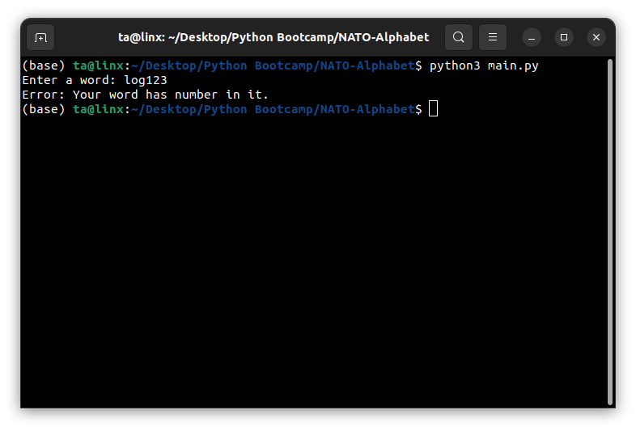

# NATO Phonetic Code Generator in Python

### [twitter](https://twitter.com/achte_te)

## Description

Generate the NATO Phonetic Code for a given word. The word must not contain a number.

### Requirements:
[Python](https://www.python.org/)

```sh
$ python3 --version
Python 3.9.12
```

[Pandas](https://pandas.pydata.org/)

## Install

```sh
$ git clone git@github.com:achte-2022/NATO-Alphabet.git
```

## Run:

```sh
$ cd NATO-Alphabet
$ python3 main.py
```
## Application Screen

### Game Screen


### Error Screen

