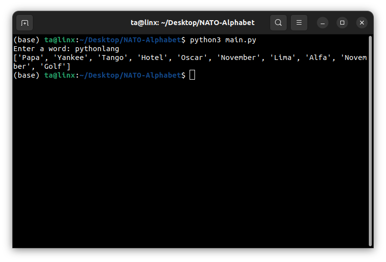

# NATO Phonetic Code Generator in Python

Tejas Acharya
[Twitter](https://twitter.com/achte_te)

Generate the NATO Phonetic Code for a given word.

### Requirements:
[Python](https://docs.python.org/)

[Pandas](https://pandas.pydata.org/)


To Run:
```sh
git clone git@github.com:achte-2022/NATO-Alphabet.git
cd NATO-Alphabet
python3 main.py
```

### Game Screen

